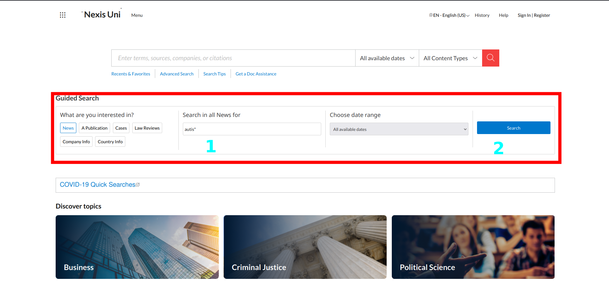
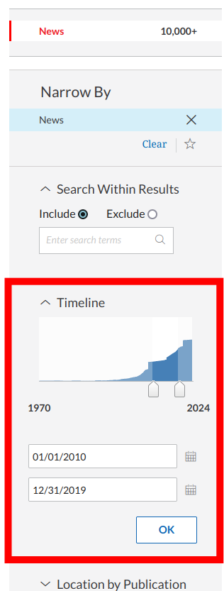

# Downloading RTF Files from NexisUni

This document covers how to access and download the documents that we are using to form the corpus for the project.

**Sections:**
1. Accessing NexisUni (formerly LexisNexis, henceforth Nexis) via the WWU library
2. Executing searches on Nexis
3. Downloading search result files
4. Running `rtf_scrape.py`

## Accessing Nexis via WWU Libraries
1. Go to [this link](https://ezproxy.library.wwu.edu/login?url=https://www.nexisuni.com)
2. If prompted, sign in using your SSO (e.g. email) credentials
3. The page should look something like this:

## Executing Your Searches on Nexis
1. Using the guided search box, enter your search term(s) (refer to personal instructions) in the "Search in all News for" text box (`autis*` in this example)
2. Hit "Search"

3. On the left side of the search results screen, expand the "Timeline" section, and enter the decade of interest (2010s in this example), then click "OK".

## Downloading Results
1. Select the download button at the top of the search results
2. Under "Basic Options", select the following:

    - *What do you want to download?* : **Full documents**
    - *Enter one or more row ranges to export* : ***Refer to your personal instructions***
    - *File type* : **Rich Text Format (rtf)**
    - *When downloading multiple documents* : **Save as individual files**

3. Click "Download"
4. After processing (bottom-left corner of the window), a zip file will be downloaded. Rename it per your personal instructions.

## Running `rtf_scrape.py`

Honestly, I wouldn't blame you if you just sent me the zip files, and let me deal with this; if you *really* want to run it yourself, here's how.

1. Extract the zip
2. Modify the variable `root_path` to the location of the extracted folder
3. Modify `out_path` to where you want the json file to be written
4. It might be easier if you just purge the `argparse` stuff and just set the paths directly.
5. Install dependencies (`striprtf`, `tqdm`), and run the script